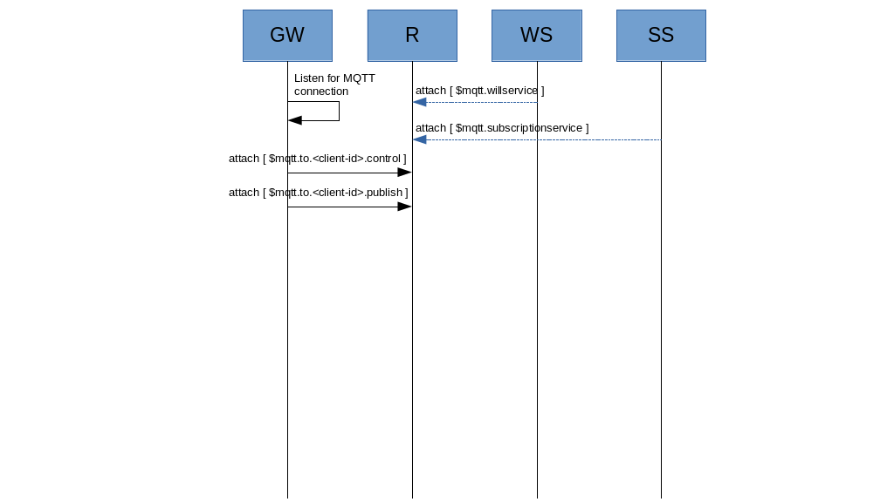

# Components

The macro components for handling MQTT over AMQP are :

* **Front End (FE)** : it's in charge to handle MQTT connections with remote clients on one side and communicate via AMQP on the other side in order to bring MQTT features on top of AMQP.
* **Back End (BE)** : it's made of “services” which are accessible through some “control” AMQP addresses and provide MQTT features through AMQP.

The mentioned AMQP services could be :

* **Will Service (WS)** : handles storing of “will” messages and their publishing when needed.
* **Subscription Service (SS)** : handles the clients session about subscriptions and published messages (when client is offline); it provides subscriptions list and “lost” messages when a client re-connect. It’s in charge to deliver a retained message when it’s available for a subscribed topic from a client.

Every single service can be implemented as stand-alone software component or we can leverage on existing features on broker/container (for example).

