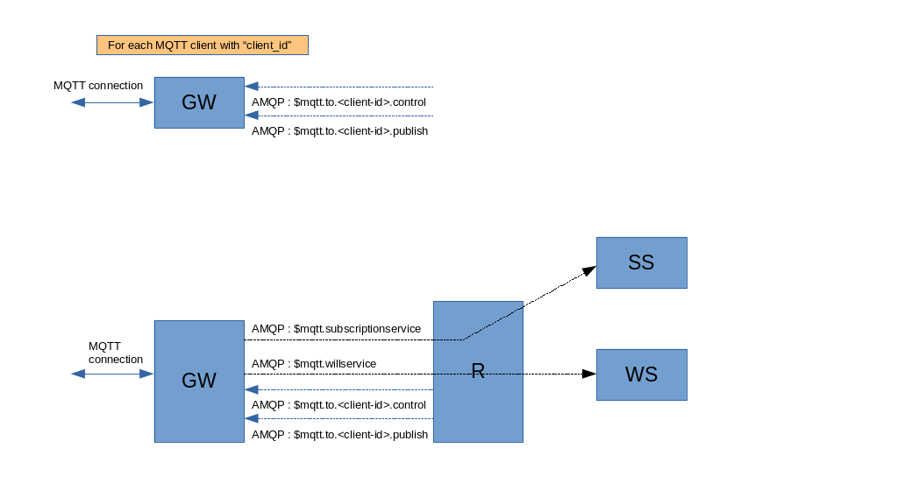

# Components

The macro components for handling MQTT over AMQP are :

* **Gateway (GW)** : it's in charge to handle MQTT connections with remote clients on one side and communicate via AMQP on the other side in order to bring MQTT features on top of AMQP.
* **Backend (BE)** : it's made of “services” which are accessible through some “control” AMQP addresses providing MQTT features over AMQP.

The mentioned AMQP services are :

* **Will Service (WS)** : handles storing of “will” messages and their publishing when needed.
* **Subscription Service (SS)** : handles the clients session about subscriptions and published messages (when client is offline); it recovers subscriptions and starts sending “lost” messages when a client re-connect. It’s in charge to deliver a retained message when it’s available for a subscribed topic from a client.

Every single service can be implemented as stand-alone software component or we can leverage on existing features on broker/container (for example). The overall architecture can leverage on an AMQP router network.

Following the main connections established by the services for providing their "control" addresses and connections established for every MQTT client.

