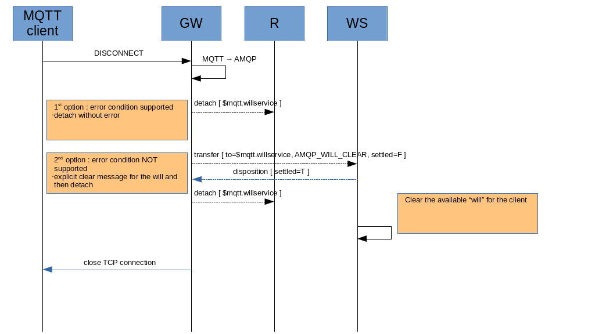
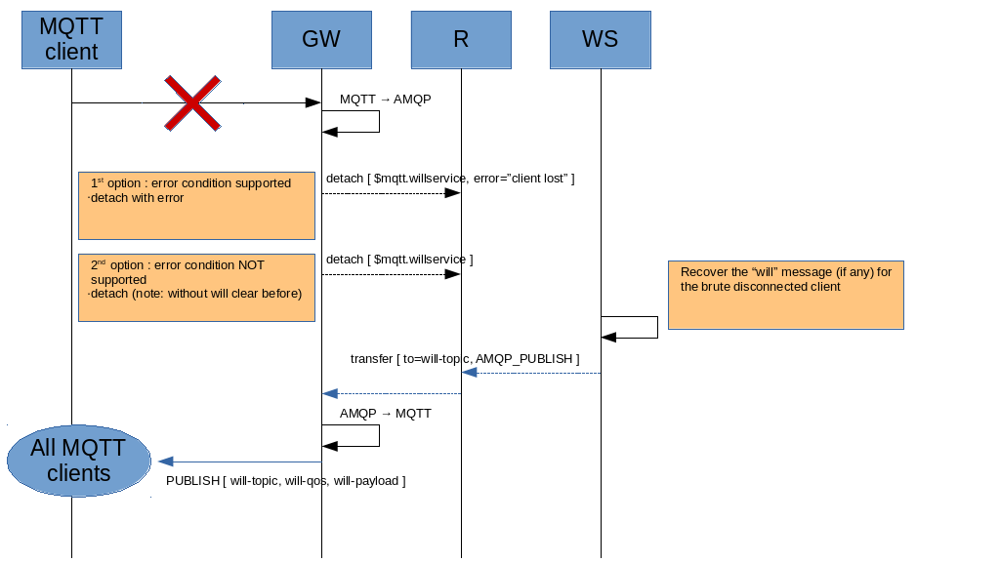

# Disconnection

The FE detects a disconnection from the MQTT client (brute or clean through _DISCONNECT_ message) and builds the following AMQP messages :

**AMQP_WILL_CLEAR** : sent to the WS in order to delete the “will” information for a client (i.e. “clean” disconnection).

| DATA | TYPE | VALUE | FROM |
| ---- | ---- | ----- | ---- |
| subject | system property | "will-clear" | - |

The _AMQP_WILL_CLEAR_ is sent as "unsettled", in order to know that the Will Service has received it (with related disposition).
The relation between the _AMQP_WILL_CLEAR_ message and the related client, at AMQP level, is inferred by the link name attached to the WS control address.

Regarding the “will” publishing on disconnection, the two following scenarios are possible :

* on clean disconnection by MQTT client, the FE detaches the permanent link to the WS (on $mqtt.willservice address) with no “error” condition. In this way the WS knows that “will” information for that link-name (so related client-id) needs to be cleaned but no “will” publishing happens.
* on brute disconnection by MQTT, client, the FE detaches the permanent link to the WS (on $mqtt.willservice address) with an “error” condition. In this way the WS knows that before cleaning the “will” information for that link-name (so related client-id), it needs to start publishing the “will” message.

If specifying “error” in the detach is not possible, the WS tries to publish “will” on detach but the following approach can be followed :

* on clean disconnection by MQTT client, the FE sends the _AMQP_WILL_CLEAR_ message to the WS (of course, before detaching) in order to clear the “will” and then detaches the link. The WS tries to publish the “will” (raised by the detach) but it has now “will” to publish (due to the previous clear).
* on brute disconnection by MQTT client, the FE just detaches the the link so that the WS just starts to publish the “will”; after that it clear the “will” automatically.

> if WS crashes, on restart it should send 	all the “will” messages it has. After that it should delete “will” information for those clients which don’t reconnect in a reasonable time (a timeout should be defined). It could be good to avoid sending “will” messages. If the WS can establish beyond doubt that the client did not lose connectivity (we are speaking about connectivity between MQTT client and FE component).
