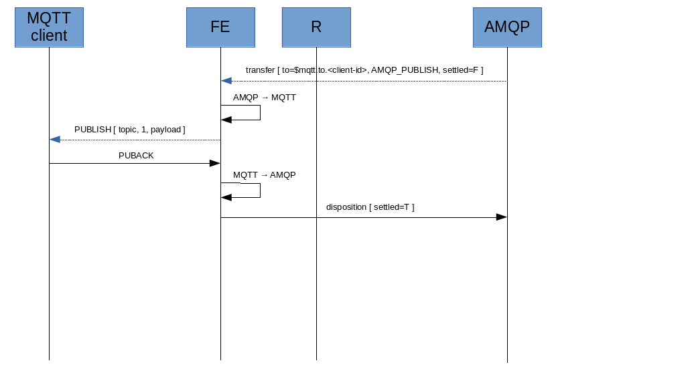

# Publish

## From MQTT client to AMQP network

The FE needs an attached link with sender role to the topic address. The QoS level for attaching link depends on the publishing QoS.

Actually two links are attached :

* one link shared between messages published with QoS levels 0 and 1.
* one link only for messages published with QoS 2, because recovering link could be needed.

Both links are attached with :

* rcv-settle-mode : first (0)
* snd-settle-mode : unsettled (0)

The MQTT client sends _PUBLISH_ message to FE which maps the message to the following AMQP messages.

**AMQP_PUBLISH** : sent to the “topic” address

| DATA | TYPE | VALUE | FROM |
| ---- | ---- | ----- | ---- |
| subject | system property | "publish" | - |
| message-id | system property | MessageId | MQTT PUBLISH |
| x-retain | message annotation | Retain flag | MQTT PUBLISH |
| x-qos | message annotation | QoS level | MQTT PUBLISH |
| durable | header | QoS level | MQTT PUBLISH |
| to | system property | topic | MQTT PUBLISH |
| delivery-count | header | DUP flag | MQTT PUBLISH |
| payload | Data section | Message payload | MQTT PUBLISH |

> the MQTT QoS level is copied to the x-qos annotation. At same time the "durable" header field is set as FALSE if QoS level is 0, TRUE if QoS level is 1 or 2. When the x-qos annotations isn't present (i.e. AMQP_WILL published from a native AMQP client which doesn't add it), fallback to use only "durable" and if it's TRUE consider QoS level 1.

### QoS level 0 (AT_MOST_ONCE)

For QoS level 0, no acknowledge is provided.

### QoS level 1 (AT_LEAST_ONCE)

For QoS level 1, after disposition on the AMQP client, the FE sends the _PUBACK_ to the MQTT client.

### QoS level 2 (EXACTLY_ONCE)

For QoS level 2, the FE sends the _AMQP_PUBLISH_ message as "unsettled" waiting for disposition (with "unsettled"); after receiving it, FE sends the _PUBREC_ to the MQTT client and the first step in the acknowledge process ends. The MQTT client replies with _PUBREL_ message; the FE sends the disposition (with "settled") waiting for the receiver disposition (with "settled") so that it can send the _PUBCOMP_ to the MQTT client.

From the above images it's clear that the FE doesn't detach the link on the topic for each publish; it leaves the link attached.

A timeout could be used to detect links inactivity for detaching them.

## From AMQP network to MQTT client

The FE has an attached link with receiver role to the unique client address $mqtt.to.[client-id] where all published messages are conveyed (see "Connection").

The FE receives published messages as _AMQP_PUBLISH_ messages (see previous paragraph).

### QoS level 0 (AT_MOST_ONCE)

For QoS level 0, message is published as "settled" and no acknowledge is needed.

### QoS level 1 (AT_LEAST_ONCE)

For QoS level 1, message is published as "unsettled". The FE sends the _PUBLISH_ to the MQTT client waiting for _PUBACK_; after receving it, FE sends the disposition (with "settled") to acknowledge the message.

### QoS level 2 (EXACTLY_ONCE)

For QoS level 2, message is published as "unsettled". The FE sends the _PUBLISH_ to the MQTT client waiting for _PUBREC_; after receving it, FE sends the disposition (with "settled"). The first step in the acknowledge process ends and the AMQP side starts the next step sending an _AMQP_PUBREL_ message as "unsettled". The FE sends the corresponding _PUBREL_ to the MQTT client waiting for _PUBCOMP_; after receiving it, FE sends the disposition (with "settled").

**AMQP_PUBREL** : sent to the unique client address $mqtt.to.[client-id]

| DATA | TYPE | VALUE | FROM |
| ---- | ---- | ----- | ---- |
| subject | system property | "pubrel" | - |
| message-id | system property | MessageId | AMQP_PUBLISH |

