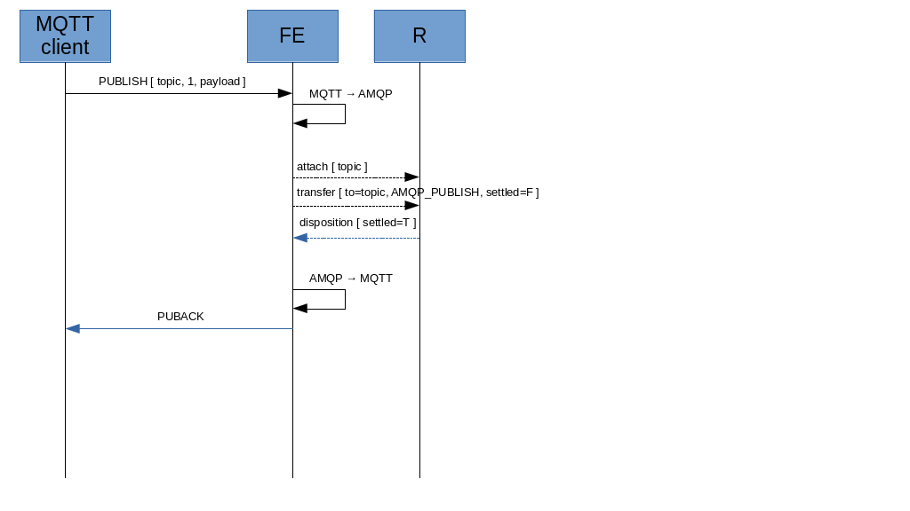

# Publish

The MQTT client sends _PUBLISH_ message to FE which maps the message to the following AMQP messages.

**AMQP_PUBLISH** : sent to the “topic” address

| DATA | TYPE | VALUE | FROM |
| ---- | ---- | ----- | ---- |
| subject | system property | "publish" | - |
| message-id | system property | MessageId | MQTT PUBLISH |
| x-retain | message annotation | Retain flag | MQTT PUBLISH |
| x-desired-snd-settle-mode | message annotation | QoS level | MQTT PUBLISH |
| x-desired-rcv-settle-mode | message annotation | QoS level | MQTT PUBLISH |
| to | system property | topic | MQTT PUBLISH |
| delivery-count | header | DUP flag | MQTT PUBLISH |
| payload | Data section | Message payload | MQTT PUBLISH |

> the MQTT QoS level is mapped to the AMQP couple snd-settle-mode and rcv-settle-mode. It defines what AMQP settle mode will be used for delivering message

The requested QoS is represented by the “snd-settle-mode” and “rcv-settle-mode” in the attach performative.

* QoS 0 :
  * snd-settle-mode : settled (1)
* QoS 1 :
  * rcv-settle-mode : first (0)
  * snd-settle-mode : unsettled (0)
* QoS 2 :
  * rcv-settle-mode: second (1)
  * snd-settle-mode : unsettled (1)

For QoS 0, no acknowledge is provided.

For QoS 1, after disposition on the AMQP client, the FE sends the _PUBACK_ to the MQTT client.

For QoS 2, we have intermediate _PUBREC_, _PUBREL_ and _PUBCOMP_ to send from FE to MQTT client.

From the above images it's clear that the FE doesn't detach the link on the topic for each publish; it leaves the link attached.
It's also true that on every _PUBLISH_ message, the MQTT remote client can specify a different QoS level. It means that if the link on the requested topic is already attached with a specific QoS (settle mode) that is different from the new one, the FE should detaches the link and reattaches it with the new requested QoS level (settle mode).
