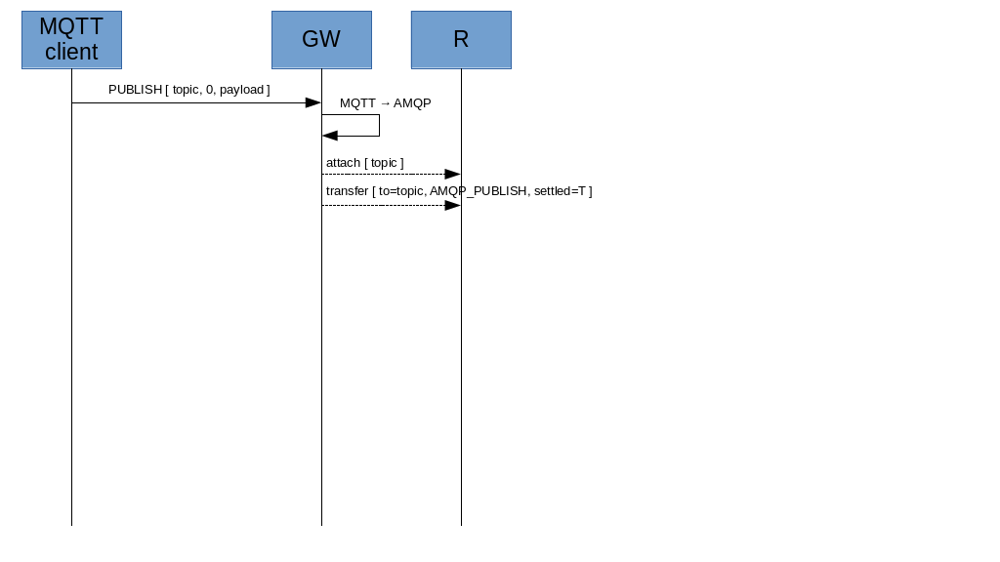
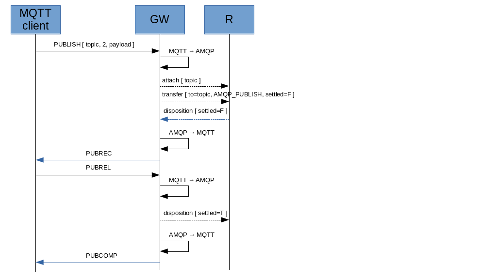
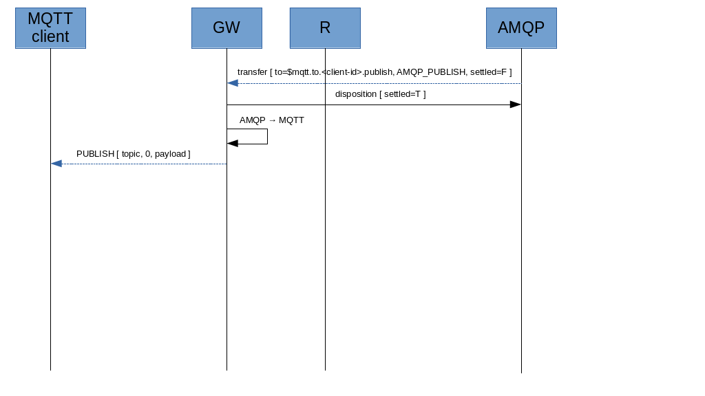
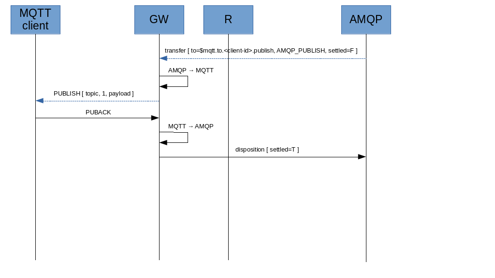
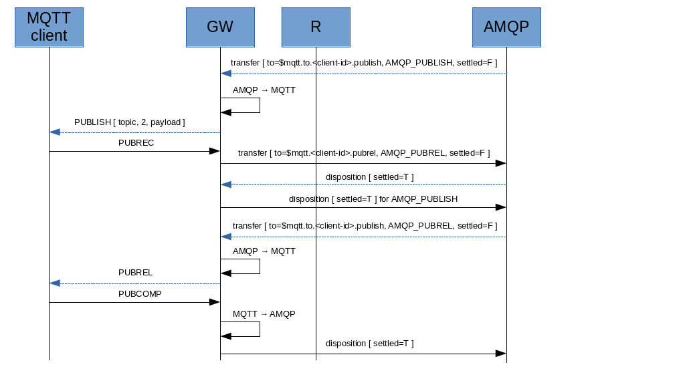

# Publish

## From MQTT client to AMQP network

The FE needs an attached link with sender role to the topic address. The QoS level for attaching link depends on the publishing QoS.

Actually two links are attached :

* one link shared between messages published with QoS levels 0 and 1.
* one link only for messages published with QoS 2, because recovering link could be needed.

The link for QoS levels 0 and 1 is attached with :

* rcv-settle-mode : first (0)
* snd-settle-mode : unsettled (0)

The link for QoS level 2 is attached with :

* rcv-settle-mode : second (1)
* snd-settle-mode : unsettled (0)

The MQTT client sends _PUBLISH_ message to FE which maps the message to the following AMQP messages.

**AMQP_PUBLISH** : sent to the “topic” address

| DATA | TYPE | VALUE | FROM |
| ---- | ---- | ----- | ---- |
| subject | system property | "publish" | - |
| message-id | system property | MessageId | MQTT PUBLISH |
| x-retain | message annotation | Retain flag | MQTT PUBLISH |
| x-qos | message annotation | QoS level | MQTT PUBLISH |
| durable | header | QoS level > 0 | MQTT PUBLISH |
| to | system property | topic | MQTT PUBLISH |
| delivery-count | header | DUP flag | MQTT PUBLISH |
| payload | Data section | Message payload | MQTT PUBLISH |

> the MQTT QoS level is copied to the x-qos annotation. At same time the "durable" header field is set as FALSE if QoS level is 0, TRUE if QoS level is 1 or 2. When the x-qos annotations isn't present (i.e. AMQP_WILL published from a native AMQP client which doesn't add it), fallback to use only "durable" and if it's TRUE consider QoS level 1.

### QoS level 0 (AT_MOST_ONCE)

For QoS level 0, no acknowledge is provided.

### QoS level 1 (AT_LEAST_ONCE)

For QoS level 1, after disposition on the AMQP client, the FE sends the _PUBACK_ to the MQTT client.

### QoS level 2 (EXACTLY_ONCE)

For QoS level 2, the FE sends the _AMQP_PUBLISH_ message as "unsettled" waiting for disposition (with "unsettled"); after receiving it, FE sends the _PUBREC_ to the MQTT client and the first step in the acknowledge process ends. The MQTT client replies with _PUBREL_ message; the FE sends the disposition (with "settled") waiting for the receiver disposition (with "settled") so that it can send the _PUBCOMP_ to the MQTT client.

From the above images it's clear that the FE doesn't detach the link on the topic for each publish; it leaves the link attached.

A timeout could be used to detect links inactivity for detaching them.

## From AMQP network to MQTT client

The FE has an attached link with receiver role to the unique client address $mqtt.to.[client-id] where all published messages are conveyed (see "Connection"). This link has QoS as AT_LEAST_ONCE so in all cases, the messages received from the AMQP network is "unsettled" (even for QoS level 0).

The FE receives published messages as _AMQP_PUBLISH_ messages (see previous paragraph).

For handling QoS level 2, the FE attaches a link with sender role to the address $mqtt.[client-id].pubrel (for sending _AMQP_PUBREL_ messages). It should have QoS as AT_LEAST_ONCE so with :

* rcv-settle-mode : first (0)
* snd-settle-mode : unsettled (0)

### QoS level 0 (AT_MOST_ONCE)

For QoS level 0, message is published as "unsettled" but the FE can sends immediately the disposition (with "settled") before sending the _PUBLISH_ to the remote MQTT client and without waiting for any acknowledge (of course, due to QoS level 0).

### QoS level 1 (AT_LEAST_ONCE)

For QoS level 1, message is published as "unsettled". The FE sends the _PUBLISH_ to the MQTT client waiting for _PUBACK_; after receving it, FE sends the disposition (with "settled") to acknowledge the message.

### QoS level 2 (EXACTLY_ONCE)

For QoS level 2, message is published as "unsettled". The FE sends the _PUBLISH_ to the MQTT client waiting for _PUBREC_; after receving it, FE doesn't settle the original _AMQP_PUBLISH_ message yet. Instead, FE sends an _AMQP_PUBREL_ message to the AMQP side. The first phase of QoS 2 exchange isn't finished yet because we need to be sure that before settling the original _AMQP_PUBLISH_ message, the _AMQP_PUBREL_ is available to the AMQP network. If something goes wrong, the _AMQP_PUBLISH_ (not yet settled) is resent or the exchange restarts from sending the _AMQP_PUBREL_.
So, the FE waits for disposition (with "settled") from the _AMQP_PUBREL_ and then sends the disposition (with "settle") for the original _AMQP_PUBLISH_ message. The first phase of QoS 2 exchange is ended. Whatever it will happen, the exchange will restart from the _AMQP_PUBREL_.
In the second phase, the AMQP side publishes the _AMQP_PUBREL_ to the FE, which sends _PUBREL_ to the MQTT client and receives the _PUBCOMP_ for then sending disposition (with "settled") to the AMQP side (for the _AMQP_PUBREL_).

**AMQP_PUBREL** : sent to the unique client address $mqtt.[client-id].pubrel

| DATA | TYPE | VALUE | FROM |
| ---- | ---- | ----- | ---- |
| subject | system property | "pubrel" | - |
| message-id | system property | MessageId | AMQP_PUBLISH |

