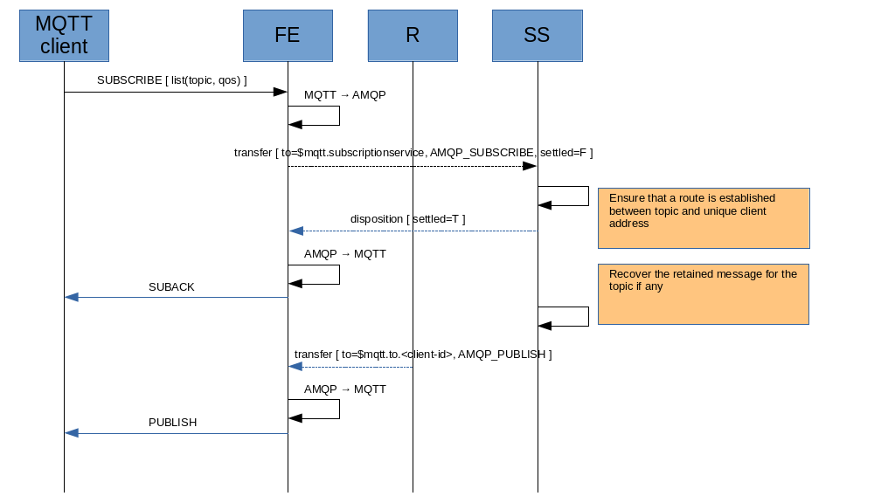
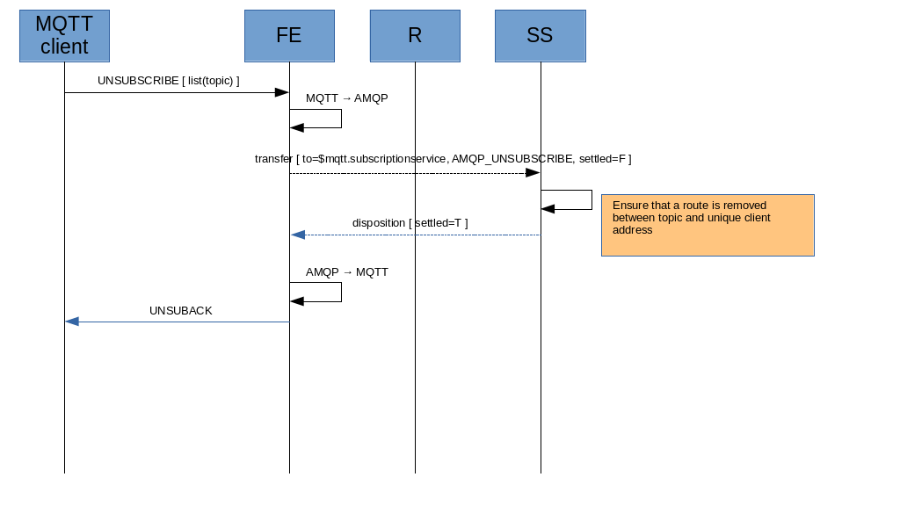

# Subscription/Unsubscription

The MQTT client sends a _SUBSCRIBE_ message to FE. The QoS is represented by the “snd-settle-mode” and “rcv-settle-mode” in the attach performative.

* QoS 0 :
  * snd-settle-mode : settled (1)
* QoS 1 :
  * rcv-settle-mode : first (0)
  * snd-settle-mode : unsettled (0)
* QoS 2 :
  * rcv-settle-mode: second (1)
  * snd-settle-mode : unsettled (1)

The FE maps the _SUBSCRIBE_ message to the following AMQP message.

**AMQP_SUBSCRIBE** : sent to the SS in order to ask establishing a route between the topics and unique client address $mqtt.to.[client-id].

| DATA | TYPE | VALUE | FROM |
| ---- | ---- | ----- | ---- |
| subject | system property | "subscribe" | - |
| reply-to | system property | $mqtt.to.[client-id] | - |
| payload | AMQP value | Map with two lists (topics and desired-settle-modes) | MQTT SUSBCRIBE |

> "topics" is just a list of topic names; "desired-settle-modes" is a list of couples with sender and receiver settle mode

After sending the _AMQP_SUBSCRIBE_, the FE should receive the following messages as reply.

**AMQP_SUBACK** : the result of a subscription request.

| DATA | TYPE | VALUE | FROM |
| ---- | ---- | ----- | ---- |
| subject | system property | "suback" | - |
| payload | AMQP value | List of granted QoS (or failure) | - |

> the granted QoS is a list of couples with sender and receiver settle mode (both can be "null" for failure)

The FE could receive the following message as reply on the unique client address.

**AMQP_PUBLISH** : the retained message to deliver to the client (see “Publishing”)

> the retained message is sent to the unique client address and it's not published on the topic because only that client should receive the message (not all the other subscribers for the topic itself).

Finally, the FE builds the _SUBACK_ message as response for the MQTT client and eventually the _PUBLISH_ for a retained message.

**SUBACK**

| DATA | VALUE | FROM |
| ---- | ----- | ---- |
| Return codes | List of granted QoS (or failure) | AMQP_SUBACK |

When subscribed/attached, the FE receives published messages on the unique client address :

* $mqtt.to.[client-id]

The AMQP message is used by FE for building the _PUBLISH_ message to send to the MQTT client (see “Publishing”). The _PUBACK_ (QoS 1) or _PUBREC_/_PUBCOMP_ (QoS 2) are used by FE and related AMQP client for sending the disposition with right settlement.

The MQTT client sends an _UNSUBSCRIBE_ message to FE which maps to the following AMQP message.

**AMQP_UNSUBSCRIBE** : sent to the SS in order to ask removing the established route between the topic and unique client address $mqtt.to.[client-id].

| DATA | TYPE | VALUE | FROM |
| ---- | ---- | ----- | ---- |
| subject | system property | "unsubscribe" | - |
| reply-to | system property | $mqtt.to.[client-id] | - |
| payload | AMQP value | List of topics | MQTT SUSBCRIBE |

After sending the _AMQP_UNSUBSCRIBE_, the FE receives the following messages as reply.

**AMQP_UNSUBACK** : the result of an unsubscription request.

| DATA | TYPE | VALUE | FROM |
| ---- | ---- | ----- | ---- |
| subject | system property | "unsuback" | - |

Finally, the FE builds the _UNSUBACK_ message as response for the MQTT client.

